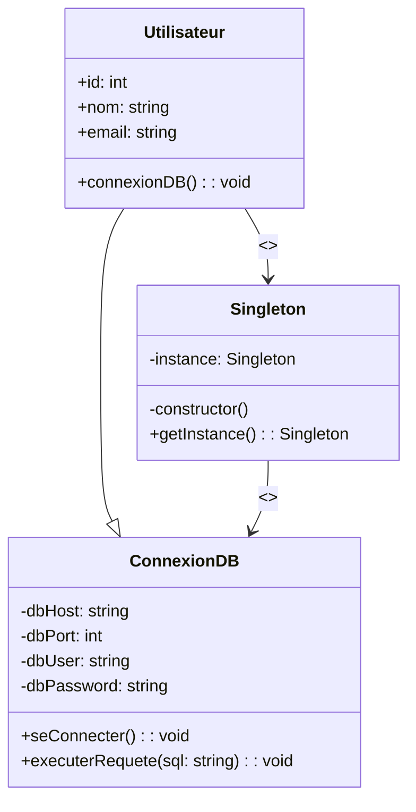

```mermaid
classDiagram
    class Utilisateur {
        +id: int
        +nom: string
        +email: string
        +connexionDB(): void
    }
    class Singleton {
        -instance: Singleton
        -constructor()
        +getInstance(): Singleton
    }
    class ConnexionDB {
        -dbHost: string
        -dbPort: int
        -dbUser: string
        -dbPassword: string
        +seConnecter(): void
        +executerRequete(sql: string): void
    }
    Utilisateur --|> ConnexionDB
    Utilisateur --> Singleton : <<utilise>>
    Singleton --> ConnexionDB : <<utilise>>
```