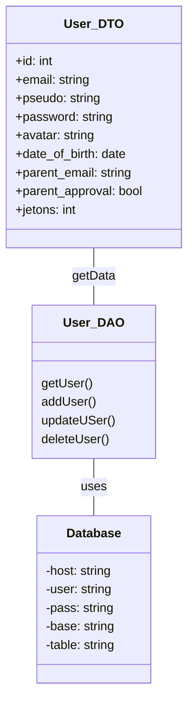

```mermaid
classDiagram
User_DTO -- User_DAO : getData
User_DAO -- Database : uses

class User_DAO {
getUser()
addUser()
updateUSer()
deleteUser()
}
class User_DTO {
+id: int
+email: string
+pseudo: string
+password: string
+avatar: string
+date_of_birth: date
+parent_email: string
+parent_approval: bool
+jetons: int
}
class Database {
-host: string
-user: string
-pass: string
-base: string
-table: string
}
```
